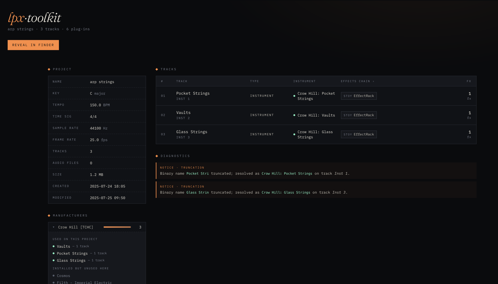

# lpx-toolkit

Inspect a Logic Pro project from the command line — see every plugin, track, and bit of metadata without opening Logic.

> [!WARNING]
> **Use at your own risk.** `lpx-toolkit` parses an undocumented binary format that Apple may change at any time. It is strictly read-only — there is a SHA-256 invariant test that fails the build if any byte of a project is ever modified — but you are still pointing it at irreplaceable creative work. Always keep backups. The author accepts no liability for project corruption, data loss, or anything else that might go wrong.



```
$ lpxtool ~/Music/Logic/piano.logicx

Project:        piano
Created:        2024-02-29 20:23
Modified:       2024-03-01 13:55
Key:            C major
Time signature: 4/4
Tempo:          105 BPM
Tracks:         3

=== TRACKS (3 active) ===
   1. EZkeys 2  (Inst 1)  [instrument]
        Instrument: Toontrack: EZkeys 2 [aumu/EZk2/Toon]
   2. Scaler 2  (Inst 2)  [instrument]
        Instrument: Plugin Boutique: Scaler 2 [aumu/Scl2/eMai]
   3. Pigments  (Inst 3)  [instrument]
        Instrument: Arturia: Pigments [aumu/Kat1/Artu]
```

## Why you might want this

- **"Which plugins does this project need?"** Before opening a project on a new machine, see the full plugin manifest up front.
- **"Which of my installed plugins do I actually use?"** Run `--rollup` across your whole library to find out.
- **"What's in this project file?"** Inspect tempo, key, track list, and FX chains for any project — even ones you can't open because a plugin is missing.
- **Scripting and automation.** Pipe `--json` into other tools, generate reports, audit project archives.

## Requirements

- macOS
- Python 3.10 or newer
- A `.logicx` project to inspect

## Install

The easiest route is [`uv`](https://docs.astral.sh/uv/) — no clone, no venv, no install. If you have `uv`, you can run `lpxtool` straight from GitHub:

```sh
uvx --from git+https://github.com/rhydlewis/lpx-toolkit lpxtool ~/Music/Logic/SomeProject.logicx
```

`uvx` builds an isolated environment on first run and caches it; subsequent runs are instant. This is the Python equivalent of `npx`.

Prefer a permanent install? Use [`pipx`](https://pipx.pypa.io/):

```sh
pipx install git+https://github.com/rhydlewis/lpx-toolkit
lpxtool ~/Music/Logic/SomeProject.logicx
```

Or clone and install into a virtual environment:

```sh
git clone https://github.com/rhydlewis/lpx-toolkit.git
cd lpx-toolkit
python3 -m venv .venv
.venv/bin/pip install -e .
.venv/bin/lpxtool ~/Music/Logic/SomeProject.logicx
```

## Usage

```sh
# Plain text report
lpxtool ~/Music/Logic/SomeProject.logicx

# Self-contained HTML dashboard (opens in your browser)
lpxtool --html ~/Music/Logic/SomeProject.logicx

# Browse your whole library in a local web app
lpxtool --serve ~/Music/Logic

# Structured JSON for piping into other tools
lpxtool --json ~/Music/Logic/SomeProject.logicx

# Audit plugin usage across many projects at once
lpxtool --rollup ~/Music/Logic/*.logicx
```

Run `lpxtool --help` for the full flag list.

### HTML dashboard

`--html` produces a single self-contained HTML file with project metadata, the track list, FX chains, a vendor rollup, and any "phantom" plugins still referenced from undo history. The file lands in `$TMPDIR/lpx-toolkit-<slug>.html` and opens in your default browser.

### Library browser

`--serve [DIR]` starts a local-only HTTP server (bound to `127.0.0.1`) and opens the index in your default browser. Click any project to view its dashboard, with the same look as `--html`. Defaults to `~/Music/Logic` if `DIR` is omitted.

```sh
lpxtool --serve                       # browse ~/Music/Logic
lpxtool --serve --port 8080 ~/Music   # explicit port + directory
```

JSON endpoints are exposed for tooling: `/api/projects`, `/api/projects/<index>`, `/api/rollup`. Press `Ctrl-C` to stop the server.

### JSON output

`--json` emits a structured payload (project metadata, per-track strip + plugin chain, vendor rollup). The schema is versioned via a top-level `schema_version` field (currently `1`).

### Cross-project rollup

`--rollup` aggregates plugin usage across many projects:

```sh
lpxtool --rollup ~/Music/Logic/*.logicx
```

Output is JSON with per-project summaries plus aggregated counts: `fingerprints` (how many projects each plugin appears in) and `vendors` (total plugin count per manufacturer). Unparseable projects are skipped with a warning to stderr; the rollup still completes.

## Caveats

- **Not a live state read.** A `.logicx` project retains references to plugins from undo history, alternative takes, and previously-deleted tracks. The output is "every plugin this project has ever referenced", not "what's loaded right now".
- **Display names can truncate.** Logic stores plugin names as ~11-character fields in the binary. Full names are recovered via `auval` when the plugin is installed.
- **`auval` needs the plugins installed** to resolve full names. Missing plugins still surface as a fingerprint — useful for "what do I need before opening this on another machine".
- **Format is undocumented.** Apple does not publish the `.logicx` internal format. Extraction relies on observed patterns and may need updates for future Logic versions.
- **Read-only.** This tool never writes to a `.logicx` file. There is no plan to ever support writing — the format is too risky to modify safely.

## Privacy

Everything runs locally. Your projects never leave your machine, and `auval` is the only external command invoked. There is no telemetry, network call, or upload of any kind.

## Contributing

Bug reports, feature ideas, and PRs are all welcome. See [`CONTRIBUTING.md`](CONTRIBUTING.md) for development setup and the areas where help is wanted.

## Licence

MIT — see `LICENSE`.
